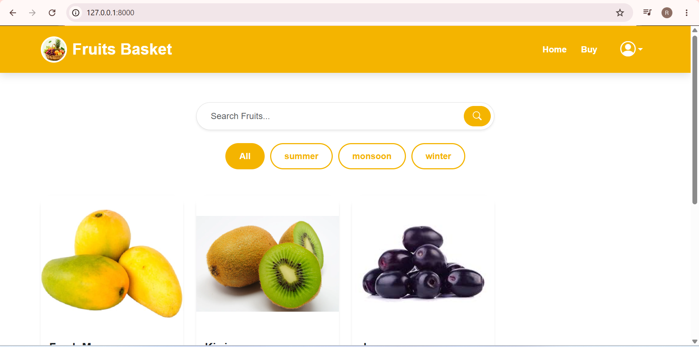
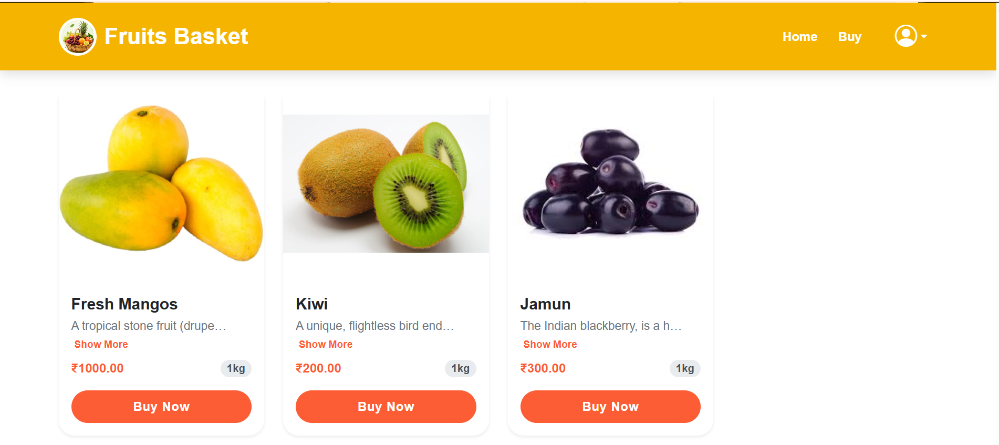
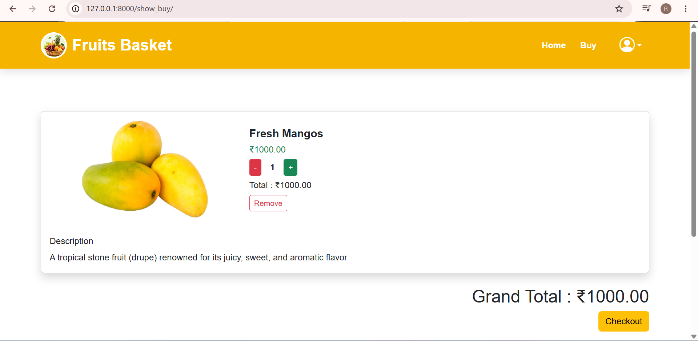
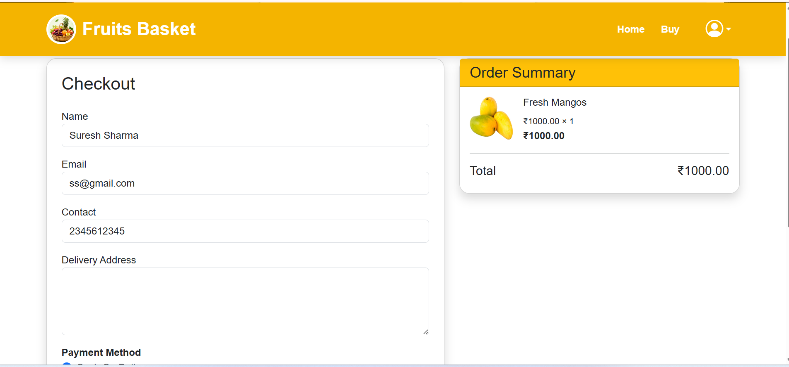

# 🍎 Fruit Basket - Django E-commerce Website

Fruit Basket is a modern e-commerce web application built with **Django**, **PostgreSQL**, **HTML**, **CSS**, **Bootstrap**, and **Portfolio Templates**. It allows users to browse fruits, search products, manage their cart, place orders, and manage their profile through a responsive interface.

---

## 🚀 Features

- User Authentication (Signup/Login/Logout)
- User Profile & Edit Profile
- Change Password
- Product Categories
- Product Search
- Shopping Cart
- Quantity Management
- Checkout System
- Order Summary
- Reorder Products
- Admin Dashboard
- Order Management
- Responsive Design
- PostgreSQL Database

---

## 🛠️ Tech Stack

- Python
- Django
- PostgreSQL
- HTML5
- CSS3
- Bootstrap 5

---

## 📸 Screenshots

### Home Page



### Product Page



### Cart



### Checkout



### Admin Dashboard


---

## ⚙️ Installation

Clone the repository

```bash
git clone https://github.com/YOUR_GITHUB_USERNAME/Fruit-Basket.git
```

Go to project folder

```bash
cd Fruit-Basket
```

Create virtual environment

```bash
python -m venv venv
```

Activate virtual environment

Windows

```bash
venv\Scripts\activate
```

Install dependencies

```bash
pip install -r requirements.txt
```

Run migrations

```bash
python manage.py migrate
```

Start server

```bash
python manage.py runserver
```

---

## 📂 Project Structure

```text
Fruit-Basket/
│
├── app/
├── templates/
├── static/
├── media/
├── requirements.txt
├── manage.py
└── README.md
```

---
## 👨‍💻 Author

**Modi Ruchin**

GitHub: https://github.com/YOUR_USERNAME

Portfolio: https://portfolio-ruz1.onrender.com

LinkedIn: https://www.linkedin.com/in/ruchin-modi-862489348/

---

⭐ If you like this project, don't forget to star the repository.